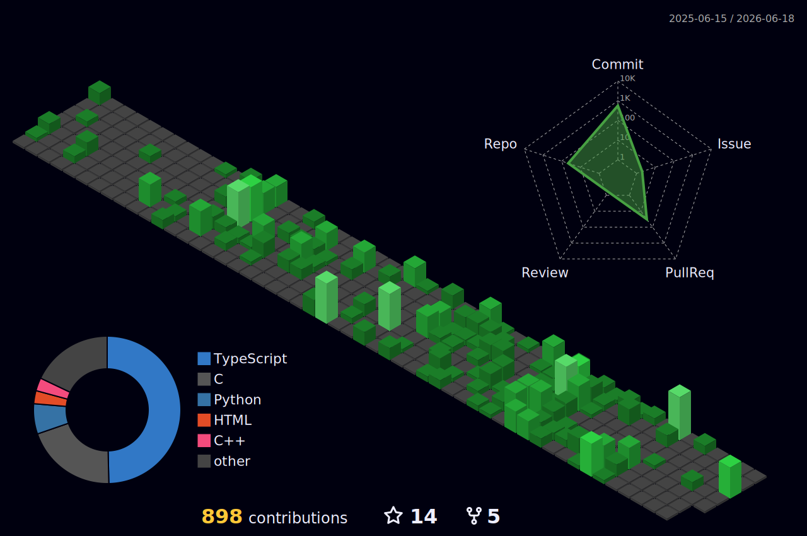

<div align="center">


<br/>

[](https://www.linkedin.com/in/satya-sarthak-manohari-b2a609297)
[](mailto:manoharisatyasarthak@gmail.com)

</div>

---

<div align="center">


</div>

---

```text
satya@github ───────────────────────────────────────
  Name ......... Satya Sarthak Manohari
  Role ......... Cybersecurity | Backend Engineer
  Location ..... Odisha, India
  Education .... B.Tech CSE (Cybersecurity) at SSU
  Internship ..... NISER, Soilveda, CyberDojo   
  Work ......... Backend Engineer
  Goal ......... "Build secure, resilient systems."

─ Tech Stack ───────────────────────────────────────
  Languages .... C, C++, Java, Python
  Backend ......  Flask, Django, FastAPI
  Database ..... PostgreSQL, MySQL, MongoDB
  Cloud/DevOps . AWS (Certified Cloud Practitioner), Docker
  Security ..... Kali Linux, Wireshark, SIEM

─ Current Focus ────────────────────────────────────
  Target ....... GATE CSE 2027 & 2028
  Focus ........ DSA & Secure Backend Systems
────────────────────────────────────────────────────
```

---

<div align="center">



</div>
