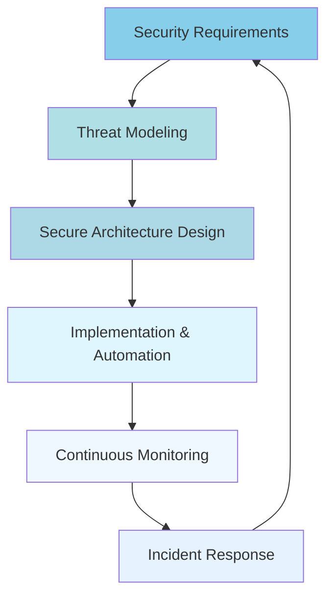

<div align="center">


<br>

[](https://www.linkedin.com/in/satya-sarthak-manohari-b2a609297)
[](mailto:manoharisatyasarthak@gmail.com)
[](https://github.com/Satya37x1112/My_Portfolio-main)
[](https://github.com/Satya37x1112)


</div>

[](https://github.com/sponsors/Satya37x1112)

## DevSecOps Engineer in the Making

From Physics-Informed Neural Networks research at NISER to building secure, scalable systems - I'm on a mission to integrate security into every layer of the software development lifecycle. My analytical research background provides a unique perspective on systematic approaches to security automation and infrastructure design.

### **Security Engineering Vision**
- **Shift-Left Security**: Embedding security controls from code to cloud
- **Infrastructure as Code**: Treating security policies as code artifacts
- **Zero Trust Architecture**: Designing systems with security-first principles
- **Continuous Security**: Automating threat detection and incident response

---

<div align="center">

## 🔧 DevSecOps Technology Stack

### **Security & DevOps Tools**


### **Security-Focused Programming**


### **Security & Monitoring Tools**


</div>

---

## System Design & Security Architecture Learning

<div align="center">



</div>

### **Current System Design Focus Areas**

| Component | Learning Focus | Security Integration |
|-----------|---------------|---------------------|
| **Microservices Security** | Service mesh, API gateways | mTLS, OAuth 2.0, Rate limiting |
| **Container Security** | Docker hardening, K8s policies | Image scanning, Runtime protection |
| **Cloud Security** | AWS/Azure security services | IAM, Network segmentation, Encryption |
| **CI/CD Security** | Secure pipelines, SAST/DAST | Secret management, Vulnerability scanning |
| **Infrastructure Security** | IaC security, Configuration management | Policy as Code, Compliance automation |

---

<div align="center">

## 🔥 GitHub Stats & Contribution Streak


<!-- Activity Graph - Shows coding activity pattern -->


<br>

<!-- Stats Cards Row -->


<br><br>

<!-- Modern Contribution Calendar with Custom Color -->


<br><br>

<!-- Trophies with Modern Dark Theme -->


<!-- Profile Views Counter with Modern Badge -->
<br>


</div>

---

<div align="center">


<div align="center">

## My Projects & Research Work

**Coming Soon!!!!!!!**

</div>

<div>
  <a href="https://wakatime.com/badge/github/Satya37x1112/My_Portfolio"></a>
</div>

## Current Status & Learning Milestones

```diff
+ NISER Research Scholar - Physics-Informed Neural Networks (PINNs)
+ Strong Programming Foundation - Python, C++, Java (Academic & Personal Projects)
+ Linux Learning - Basic system administration and command line proficiency
+ Security Interest - Starting cybersecurity and DevSecOps journey
+ Research Background - Analytical thinking and scientific problem-solving
+ DevSecOps Beginner - Actively learning Docker, CI/CD, and cloud basics
+ System Design - Learning scalable architecture and security patterns
+ Future Goal - First DevSecOps Engineering role by 2025-2026
```

---

<div align="center">

### 🤝 Connect & Collaborate

[](https://github.com/Satya37x1112/Satya37x1112/discussions)
[](#)
[](#)

**Let's build secure systems together!**


</div>
